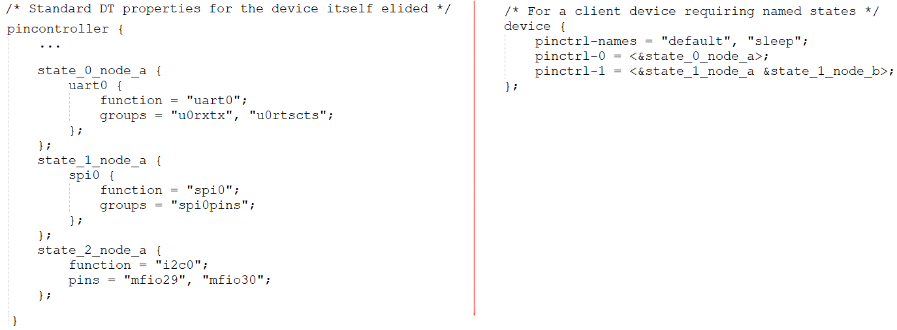
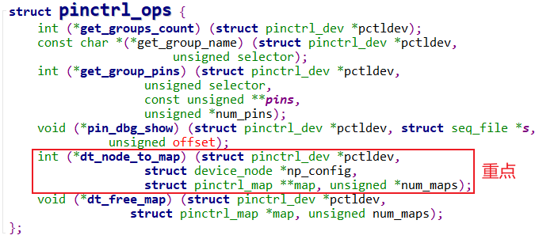
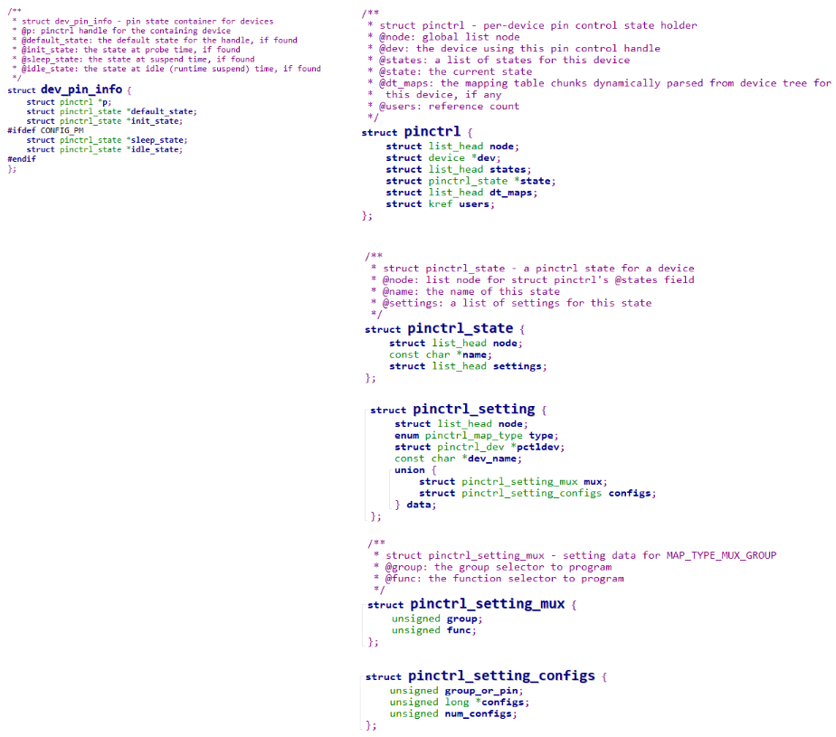

## Pinctrl子系统主要数据结构

参考资料：

* Linux 5.x内核
  * Documentation\devicetree\bindings\pinctrl\pinctrl-bindings.txt
  * arch/arm/boot/dts/stm32mp151.dtsi
  * arch/arm/boot/dts/stm32mp157-100ask-pinctrl.dtsi  
  * arch/arm/boot/dts/stm32mp15xx-100ask.dtsi
  * drivers\pinctrl\stm32\pinctrl-stm32mp157.c
  * drivers\pinctrl\stm32\pinctrl-stm32.c
* Linux 4.x内核文档
  * Documentation\pinctrl.txt
  * Documentation\devicetree\bindings\pinctrl\pinctrl-bindings.txt
  * arch/arm/boot/dts/imx6ull-14x14-evk.dts
  * arch/arm/boot/dts/100ask_imx6ull-14x14.dts
  * drivers\pinctrl\freescale\pinctrl-imx6ul.c
  * drivers\pinctrl\freescale\pinctrl-imx.c

### 1. 设备树

#### 1.1 理想模型



#### 1.2 实际的例子

* IMX6ULL

  

* STM32MP157

  


### 2. pincontroller的数据结构

记住pinctrl的三大作用，有助于理解所涉及的数据结构：

* 引脚枚举与命名(Enumerating and naming)
* 引脚复用(Multiplexing)：比如用作GPIO、I2C或其他功能
* 引脚配置(Configuration)：比如上拉、下来、open drain、驱动强度等

#### 2.1 pinctrl_desc和pinctrl_dev

##### 1. 结构体引入

pincontroller虽然是一个软件的概念，但是它背后是有硬件支持的，所以可以使用一个结构体来表示它：pinctrl_dev。

怎么构造出pinctrl_dev？我们只需要描述它：提供一个pinctrl_desc，然后调用pinctrl_register就可以：

```c
struct pinctrl_dev *pinctrl_register(struct pinctrl_desc *pctldesc,
				    struct device *dev, void *driver_data);
```


怎么使用pinctrl_desc、pinctrl_dev来描述一个pin controller？这两个结构体定义如下：


pinctrl_desc示例如下：


##### 2. 作用1：描述、获得引脚

使用结构体pinctrl_pin_desc来描述一个引脚，一个pin controller有多个引脚：


使用pinctrl_ops来操作引脚，主要功能有二：

* 来取出某组的引脚：get_groups_count、get_group_pins
* 处理设备树中pin controller中的某个节点：dt_node_to_map，把device_node转换为一系列的pinctrl_map



##### 3. 作用2：引脚复用


##### 4. 作用3：引脚配置


##### 5. 使用pinctrl_desc注册得到pinctrl_dev

调用devm_pinctrl_register或pinctrl_register，就可以根据pinctrl_desc构造出pinctrl_dev，并且把pinctrl_dev放入链表：

```c
devm_pinctrl_register
    pinctrl_register
    	struct pinctrl_dev *pctldev;
		pctldev = kzalloc(sizeof(*pctldev), GFP_KERNEL);

		pctldev->owner = pctldesc->owner;
		pctldev->desc = pctldesc;
		pctldev->driver_data = driver_data;

		/* check core ops for sanity */
		ret = pinctrl_check_ops(pctldev);

		/* If we're implementing pinmuxing, check the ops for sanity */
		ret = pinmux_check_ops(pctldev);

		/* If we're implementing pinconfig, check the ops for sanity */
		ret = pinconf_check_ops(pctldev);

		/* Register all the pins */
		ret = pinctrl_register_pins(pctldev, pctldesc->pins, pctldesc->npins);

		list_add_tail(&pctldev->node, &pinctrldev_list);
```


### 3. client的数据结构

在设备树中，使用pinctrl时格式如下：

```shell
/* For a client device requiring named states */
device {
    pinctrl-names = "active", "idle";
    pinctrl-0 = <&state_0_node_a>;
    pinctrl-1 = <&state_1_node_a &state_1_node_b>;
};
```

设备节点要么被转换为platform_device，或者其他结构体(比如i2c_client)，但是里面都会有一个device结构体，比如：


#### 3.1 dev_pin_info

每个device结构体里都有一个dev_pin_info结构体，用来保存设备的pinctrl信息：



#### 3.2 pinctrl

假设芯片上有多个pin controller，那么这个设备使用哪个pin controller？

这需要通过设备树来确定：

* 分析设备树，找到pin controller
* 对于每个状态，比如default、init，去分析pin controller中的设备树节点
  * 使用pin controller的pinctrl_ops.dt_node_to_map来处理设备树的pinctrl节点信息，得到一系列的pinctrl_map
  * 这些pinctrl_map放在pinctrl.dt_maps链表中
  * 每个pinctrl_map都被转换为pinctrl_setting，放在对应的pinctrl_state.settings链表中


#### 3.3 pinctrl_map和pinctrl_setting

设备引用pin controller中的某个节点时，这个节点会被转换为一些列的pinctrl_map：

* 转换为多少个pinctrl_map，完全由具体的驱动决定
* 每个pinctrl_map，又被转换为一个pinctrl_setting
* 举例，设备节点里有：`pinctrl-0 = <&state_0_node_a>`
  * pinctrl-0对应一个状态，会得到一个pinctrl_state
  * state_0_node_a节点被解析为一系列的pinctrl_map
  * 这一系列的pinctrl_map被转换为一系列的pinctrl_setting
  * 这些pinctrl_setting被放入pinctrl_state的settings链表


### 4. 使用pinctrl_setting

调用过程：

```shell
really_probe
	pinctrl_bind_pins
		pinctrl_select_state
			/* Apply all the settings for the new state */
			list_for_each_entry(setting, &state->settings, node) {
				switch (setting->type) {
				case PIN_MAP_TYPE_MUX_GROUP:
					ret = pinmux_enable_setting(setting);
							ret = ops->set_mux(...);
				break;
				case PIN_MAP_TYPE_CONFIGS_PIN:
				case PIN_MAP_TYPE_CONFIGS_GROUP:
					ret = pinconf_apply_setting(setting);
							ret = ops->pin_config_group_set(...);
					break;
				default:
					ret = -EINVAL;
				break;
			}		
```


