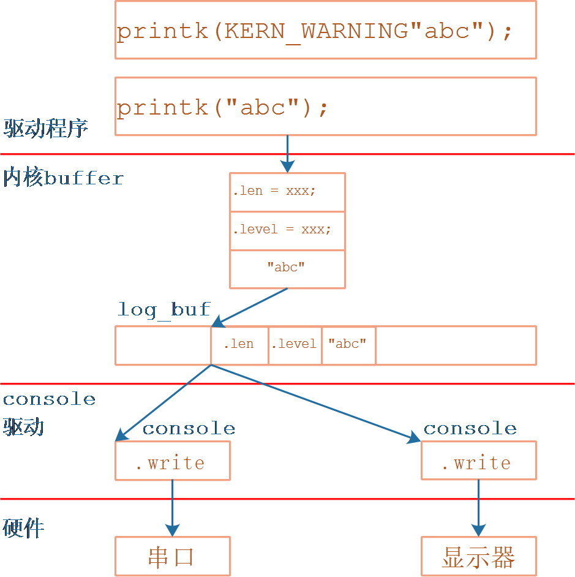

## 编写console驱动

* 参考代码

  * Linux 4.9.88
  
    ```shell
    kernel/printk.c
    include/linux/kernel.h
    kernel/printk/internal.h
    drivers/tty/serial/imx.c
    ```
  
    
  
  * Linux 5.4
  
    ```shell
    kernel/printk.c
    include/linux/kernel.h
    kernel/printk/printk_safe.c
    drivers/tty/serial/stm32-usart.
    ```
  
* 本节视频配套源码在GIT仓库里，目录如下

  ```shell
  doc_and_source_for_drivers\IMX6ULL\source\09_UART\
  	08_virtual_uart_driver_console
  
  doc_and_source_for_drivers\STM32MP157\source\A7\09_UART\
  	08_virtual_uart_driver_console
  ```

  

### 1.  回顾printk的使用



### 2. console结构体分析

`include\linux\console.h`:

```c
struct console {
	char	name[16];  // name为"ttyXXX"，在cmdline中用"console=ttyXXX0"来匹配
    
    // 输出函数
	void	(*write)(struct console *, const char *, unsigned);
    
	int	    (*read)(struct console *, char *, unsigned);
    
    // APP访问/dev/console时通过这个函数来确定是哪个(index)设备
    // 举例:
    // a. cmdline中"console=ttymxc1"
    // b. 则注册对应的console驱动时：console->index = 1
    // c. APP访问/dev/console时调用"console->device"来返回这个index
	struct  tty_driver *(*device)(struct console *co, int *index);
    
	void	(*unblank)(void);
    
    // 设置函数, 可设为NULL
	int	    (*setup)(struct console *, char *);
    
    // 匹配函数, 可设为NULL
	int	    (*match)(struct console *, char *name, int idx, char *options); 
    
	short	flags;
    
    // 哪个设备用作console: 
    // a. 可以设置为-1, 表示由cmdline=ttyVIRT0确定
    // b. 也可以直接指定
	short	index;
    
    // 常用: CON_PRINTBUFFER
	int	    cflag;
	void	*data;
	struct	 console *next;
};
```


### 3. 编写console驱动

```c
/*
 * Interrupts are disabled on entering
 */
static void virt_uart_console_write(struct console *co, const char *s, unsigned int count)
{
	int i;
	for (i = 0; i < count; i++)
		if (txbuf_put(s[i]) != 0)
			return;
}

static struct console virt_uart_console = {
	.name		= "ttyVIRT",
	.write		= virt_uart_console_write,
	.device		= uart_console_device,
	.flags		= CON_PRINTBUFFER,
	.index		= -1,
};

static struct uart_driver virt_uart_drv = {
	.owner          = THIS_MODULE,
	.driver_name    = "VIRT_UART",
	.dev_name       = "ttyVIRT",
	.major          = 0,
	.minor          = 0,
	.nr             = 1,
	.cons           = virt_uart_console,
};
```


### 4. 上机实验

#### 4.1 设置工具链

##### 1. STM32MP157

  ```shell
  export ARCH=arm
  export CROSS_COMPILE=arm-buildroot-linux-gnueabihf-
  export PATH=$PATH:/home/book/100ask_stm32mp157_pro-sdk/ToolChain/arm-buildroot-linux-gnueabihf_sdk-buildroot/bin
  ```

##### 2. IMX6ULL

  ```shell
  export ARCH=arm
  export CROSS_COMPILE=arm-linux-gnueabihf-
  export PATH=$PATH:/home/book/100ask_imx6ull-sdk/ToolChain/gcc-linaro-6.2.1-2016.11-x86_64_arm-linux-gnueabihf/bin
  ```


#### 4.2 编译驱动


#### 4.3 修改cmdline

##### 1. IMX6ULL

```
在uboot执行:
setenv mmcargs setenv bootargs console=${console},${baudrate} root=${mmcroot} console=ttyVIRT0
boot

启动linux后确认:
cat /proc/cmdline

安装驱动程序:
echo "7 4 1 7" > /proc/sys/kernel/printk
insmod virtual_uart.ko
cat /proc/consoles  /* 确认有没有ttyVIRT0 */

cat /proc/virt_uart_buf  /* 查看信息 */

echo hello > /dev/console
cat /proc/virt_uart_buf  /* 查看信息 */
```


##### 2. STM32MP157

```shell
mount /dev/mmcblk2p2 /boot

修改/boot/mmc0_extlinux/和/boot/mmc1_extlinux下的配置文件，
配置文件里的"APPEND"表示cmdline信息,
在"APPEND"行末" console=ttyVIRT0",
在三个"APPEND"语句中都添加


启动linux后确认:
cat /proc/cmdline

安装驱动程序:
insmod virtual_uart.ko
cat /proc/consoles  /* 确认有没有ttyVIRT0 */

cat /proc/virt_uart_buf  /* 查看信息 */

echo hello > /dev/console
cat /proc/virt_uart_buf  /* 查看信息 */
```


